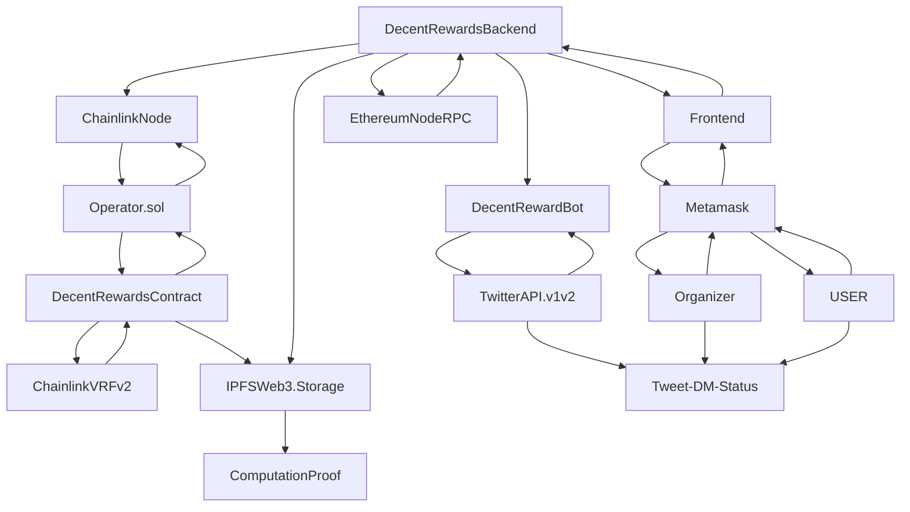

# Decentralized Rewards Project
-----------------------------

[Decentralized Rewards Project Github Repository](https://github.com/cevatbostancioglu/decentreward])

This document will explain technical aspect of project.

A project aiming to solve Web3 asset giveaways on Web2 platform using smart contracts, chainlink oracle services and IPFS web3.storage service.

[Chainlink Spring 2022 Hackathon devpost Link](https://github.com/cevatbostancioglu/decentreward])

## SW Architecture

All connections:

[README developers](https://github.com/cevatbostancioglu/decentreward/blob/main/doc/README_dev.md)

[README Chainlink Hackathon Spring 2022 - devpost - informative](https://github.com/cevatbostancioglu/decentreward/blob/main/doc/README_devpost.md)

[README Data Flow across dapp/applications/servers/api endpoints](https://github.com/cevatbostancioglu/decentreward/blob/main/doc/README_flow.md)

[README Future prospects](https://github.com/cevatbostancioglu/decentreward/blob/main/doc/README_flow.md)

