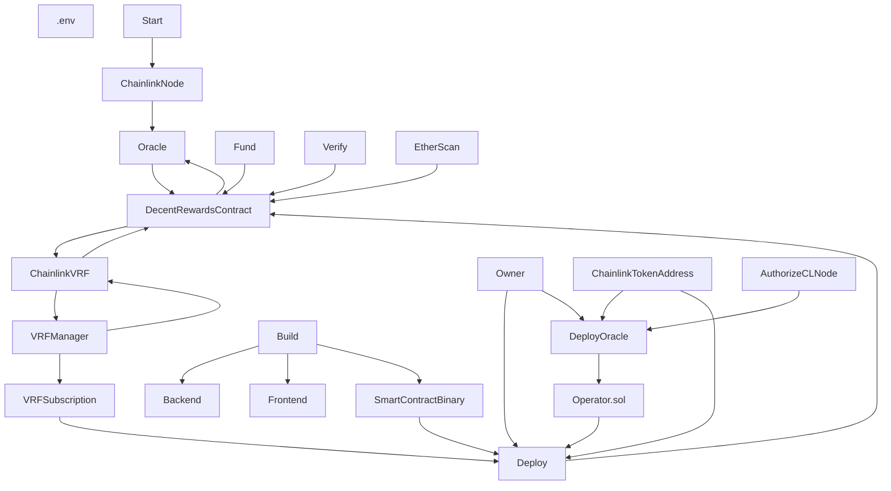

# Development Flow:

## Install dependencies
```
# scripts are using jq for parsing json
apt-get install -y jq git curl wget
#docker -> https://docs.docker.com/desktop/linux/install/
#nodejs & npm -> https://computingforgeeks.com/how-to-install-node-js-on-ubuntu-debian/
#hardhat -> https://hardhat.org/getting-started/

```

## Git submodules
```
git clone https://github.com/cevatbostancioglu/decentreward.git
cd decentreward
./initsubmodules.sh
```

## Scripts and Flow Mapping:
```
.env -> .env
Start -> cl_node/start.sh
Build -> build.sh
Fund -> fund.sh
Verify -> verify.sh
Backend -> backend/chat/index
Frontend -> frontend/rewards/
Deploy -> deploy.sh
DeployOracle -> deploy_oracle.sh
Clean -> clean.sh
```


## .env.example modification

```
# How to generate and use following Twitter API tokens.
# https://developer.twitter.com/en/docs/tutorials
export TWITTER_CONSUMER_KEY="consumer"
export TWITTER_CONSUMER_SECRET="consuer_secret"
export TWITTER_BEARER_TOKEN="bearer"
export TWITTER_ACCESS_TOKEN="access"
export TWITTER_ACCESS_TOKEN_SECRET="access_secret"
export TWITTER_OAUTH2_CLIENT_ID="oauth2_client_id"
export TWITTER_OAUTH2_CLIENT_SECRET="oauth2_client_secret"
export TWITTER_WEBHOOK_ENV="dev/prod"

# Metamask -> Create Wallet -> Save keys -> Export Priv key.
export KOVAN_PRIVATE_KEY="myawesomeprivkey"
export KOVAN_PRIVATE_KEY2="myawesomeprivkey2"
export KOVAN_PUBLIC_KEY2="myawesomepubkey2"

# INFURA 
# https://docs.infura.io/infura/getting-started
export INFURA_API_TOKEN="token"
export INFURA_PROJECT_ID="project_id"
export INFURA_PROJECT_SECRET="project_secret"

# https://docs.chain.link/docs/link-token-contracts/
export KOVAN_LINK_TOKEN_CONTRACT_ADDRESS="0xa36085F69e2889c224210F603D836748e7dC0088"
export RINKEBY_LINK_TOKEN_CONTRACT_ADDRESS="0x01BE23585060835E02B77ef475b0Cc51aA1e0709"

# VRF
# https://docs.chain.link/docs/get-a-random-number/
export CHAINLINK_VRF_SUBS_ID="vrf_sub"

# https://etherscan.io/apis
# for contract verification
export ETHERSCAN_API_KEY="key"

# https://docs.chain.link/chainlink-nodes/
export CHAINLINK_KOVAN_LOCALNODE_ETH_ADDRESS="local_kovan_node keymgmt- > address"
export CHAINLINK_RINKEBY_LOCALNODE_ETH_ADDRESS="local_rinkeby_node keymgmt- > address"

# https://web3.storage/docs/#quickstart
export WEB3STORAGE_API_TOKEN="myawesome web3.storage up to 1TB free token"

# VRF, keepers are running on rinkeby.
export NETWORK_NAME="rinkeby"
```
Prepare your environment:
```
cp .env.example .env
cp .env.example backend/chat/.env
# remove "export ="
sed -i 's/export //g' backend/chat/.env
```

## Backend
```
cd backend/chat
node index
```

## Frontend
```
cd frontend/rewards
npm start
```

## Smart Contract Deployment
```
./clean.sh 
#./clean_except_oracle.sh
./build.sh
./deploy_oracle.sh
./fund.sh
# fund vrf subs manually :/
./verify.sh
./verify_oracle.sh
```

## Chainlink Node
```
cd cl_node
./start.sh
```
