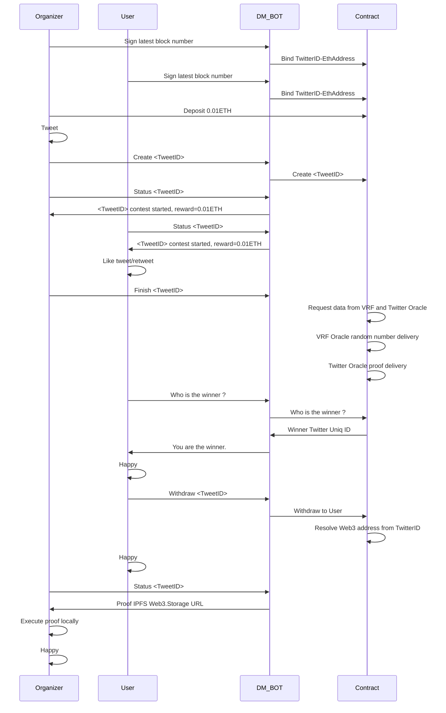
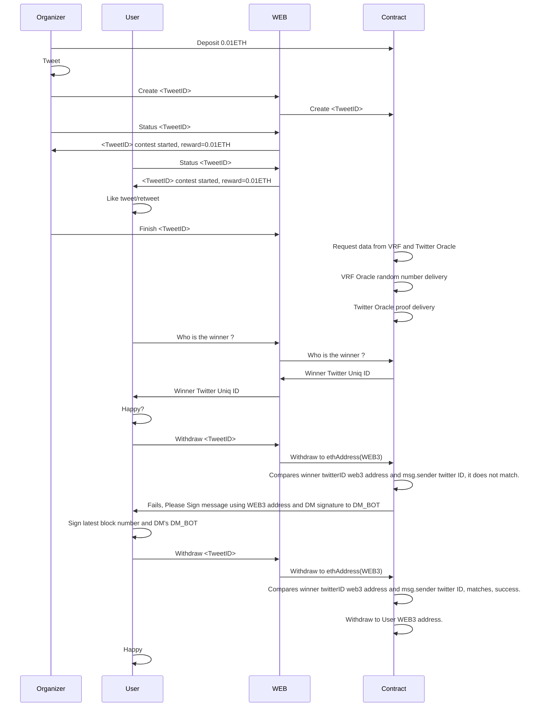
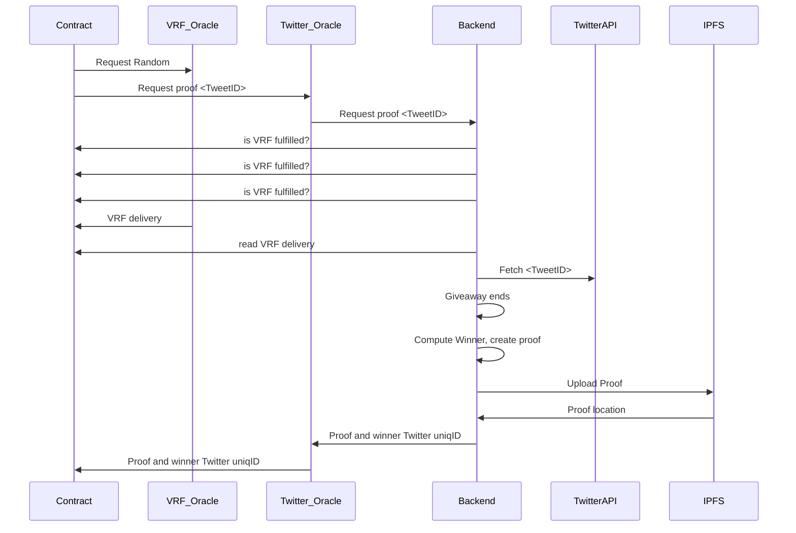

# Data Flow for managing rewards using Twitter Direct Message

## Execute proof locally
[README How anyone can execute proof locally](https://github.com/cevatbostancioglu/decentreward/blob/main/tools/README_proof.md)

# Data Flow for managing rewards Web Interface

# Smart Contract - Oracles - Backend - WEB2 - IPFS flow

