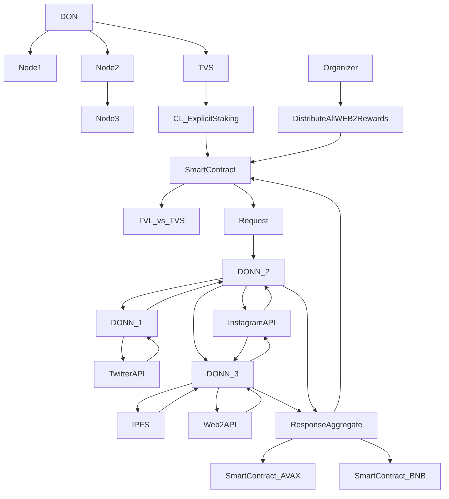
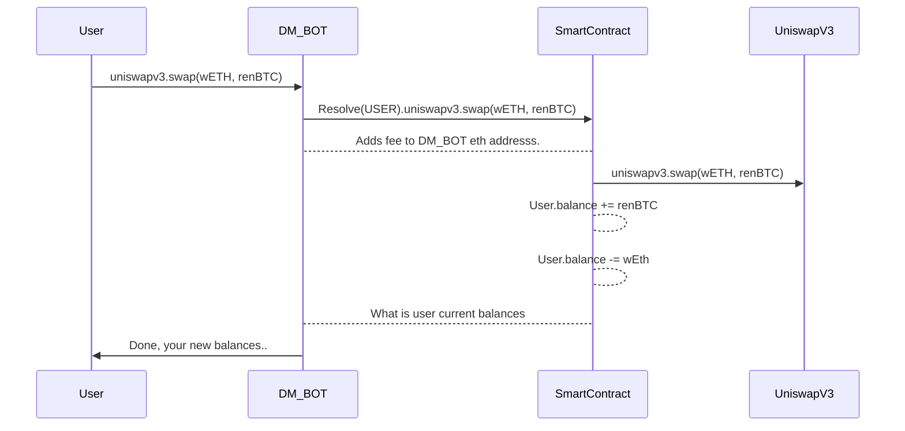

# Future with DONs

Flow:
- Organizer request rewards distribution and 3 Chainlink Nodes aggregate data and deliver data to multiple chains.
- DONN_2 dont have TwitterAPI, forwards request to DONN_1.
- DONN_1 is not in the DecentRewards Oracle network but responds to DONN_2 requests. DONN_2 imports DONN_1 data into InstagramAPI result.
- DONN_2 and DONN_3 aggregates on InstagramAPI results, DONN_3 accepts other API data too and DONN_2 deliver answer to multiple smart contract platforms.

Security:
- DON provides critical data
- Every DONN risks their future revenue, reputation, colletral for providing data.
- DON checks data and slashes bad behaving nodes.
- Smart Contracts make sure their TVL(total value locked) is always lower then DON TVS(total value secured).

# Future with WEB3 asset management from WEB2 Platforms

